# Smart Hand Rehabilitation System — Hardware

> **PCC2 Project | KTH Royal Institute of Technology | MSc Medical Engineering | Stockholm, 2026**  
> *This repository covers only the hardware design, sensor selection, wiring and embedded firmware - the physical core of the system.*
> *Other aspects of the project ( software backend , web application ) are maintained separately and only referenced here for context.*
---

## Table of Contents

- [About the Project](#about-the-project)
- [System Architecture](#system-architecture)
  - [Device Block](#device-block-this-repo)
  - [Computer Block](#computer-block-external-repos)
- [Hardware Design](#hardware-design)
  - [Microcontroller: XIAO Seeed NRF52840](#microcontroller-xiao-seeed-nrf52840)
- [Sensors](#sensors)
  - [1. Pressure Sensor — ABP-DRRV060MGAA5](#1-pressure-sensor--abp-drrv060mgaa5)
  - [2. EMG Sensor — EMG-LAB](#2-emg-sensor--emg-lab-custom-lab-board)
  - [3. IMU Sensor — LSM6DS3 (on-board NRF52840)](#3-imu-sensor--lsm6ds3-on-board-nrf52840)
- [Inter-Device Communication](#inter-device-communication)
- [Embedded Firmware](#embedded-firmware)
- [Design Evolution](#design-evolution)
- [Case Design](#case-design)
- [Device Specifications](#device-specifications)
- [Component List](#component-list)
- [Future Hardware Work](#future-hardware-work)
- [Authors](#authors)
- [License](#license)

## About the Project

Neurological disorders such as stroke, traumatic brain injury, and Parkinson's disease frequently impair hand motor function — manifesting as muscle weakness, tremor, and loss of coordination. Traditional clinical tools like handheld dynamometers capture only peak grip strength, offering an incomplete picture of neuromuscular recovery.

This project is a **low-cost, wearable hand rehabilitation system** that integrates three sensor modalities — pressure, EMG, and IMU — into a portable, Bluetooth-enabled dual-device platform. The system targets two clinical populations:

- **Stroke / Brain Injury** — emphasis on force control assessment (EMG + Pressure)
- **Parkinson's / Tremor-Dominant** — emphasis on movement quality analysis (IMU + Pressure)

The device streams real-time sensor data via Bluetooth Low Energy (BLE) to a companion web application, which guides the patient through rehabilitation exercises, computes clinically meaningful features, and logs sessions for remote clinician review.

> This repository covers the **hardware design**: electrical schematics, sensor integration, embedded firmware, and device prototyping. The web application and signal processing backend are maintained separately and briefly referenced here for context.

---

## System Architecture

The system is split into two main blocks.

### Device Block (this repo)

Two independent wearable units communicate with each other and relay all data to the computer:

```
[Forearm Unit]                         [Wrist Unit]
 ├─ NRF52840 board (Micro 1)            ├─ NRF52840 board (Micro 2)
 ├─ EMG-LAB sensor (analog, 3.3V, D0)   ├─ Pressure sensor ABP-DRRV060MGAA5 (D0)
 ├─ Li-Po 5V battery (JST)              ├─ On-board IMU LSM6DS3 (3-axis accel + gyro)
 └─ USB-B connector (UART TX/RX)        ├─ Li-Po 5V battery (JST)
                                        └─ USB-A connector (UART TX/RX)
                 │                                   │  │
                 └──────────── UART ─────────────────┘  │
                                                        │
                                                   BLE (2.4 GHz)
                                                        │
                                                    [Computer]
```

The forearm unit (Micro 1) collects EMG data, applies preliminary digital filtering on-chip, and forwards the processed samples to the wrist unit over a UART serial link. The wrist unit (Micro 2) acts as the aggregation node — it samples EMG, IMU, and pressure data and transmits everything to the computer over Bluetooth using the Nordic UART Service (NUS).

### Computer Block (external repos)

- **FastAPI backend** — receives BLE data via WebSocket, runs the signal processing and feature extraction pipeline
- **Web application** — real-time sensor visualization, exercise guidance, session logging, and longitudinal progress tracking
- **ML pipeline** — SVM state classifier pre-trained on public datasets + centroid distance longitudinal progress tracker (kNN planned as a later extension)

---

## Hardware Design

### Microcontroller: XIAO Seeed NRF52840

Both units are built around the **NRF52840** board (NRF52 family). Key properties that motivated this choice:

| Feature | Value |
|---|---|
| Processor | 32-bit ARM Cortex-M4 with FPU |
| Clock speed | 64 MHz |
| Flash | 2 MB |
| BLE | Built-in (2.4 GHz) |
| IMU | Built-in LSM6DS3 (3-axis accelerometer + gyroscope) |
| I/O | Digital + analog pins, I²C, UART |
| Power | Onboard Li-Po charging module (5V input via JST) |
| Size | Compact form factor |

All analog signal processing (filtering, ADC) happens directly on the board, eliminating the need for external op-amp circuits. This is a deliberate departure from the original design (see [Design Evolution](#design-evolution) below).

---

### Sensors

#### 1. Pressure Sensor — ABP-DRRV060MGAA5

**Purpose:** Measures grip force during exercises. Connected via a plastic tube to a rubber bulb held in the patient's hand.

| Property | Value |
|---|---|
| Supply voltage | 3.3 V |
| Output | Analog (connected to pin `D0` on wrist unit) |
| Principle | Piezoresistive — silicon diaphragm deforms under pressure, resistance change → analog voltage |
| Placement | On-board the wrist device; tube routed to patient's palm |

**Why this sensor?** A commercial dynamometer capable of real-time wireless data transmission was the original target, but budget constraints led to this pressure sensor solution. Its output voltage scales linearly with applied pressure, so it reliably captures the force waveform over time, enabling extraction of features beyond simple peak force. Unlike a rigid load cell, it integrates into a deformable object that minimizes wrist loading during tremor measurement.

**Signal preprocessing:** Butterworth low-pass filter at 20 Hz cutoff to remove high-frequency noise from hand vibrations. Optional DC baseline correction when the hand is at rest.

**Extracted features:**

| Feature | Formula / Description |
|---|---|
| Maximum Voluntary Contraction (MVC) | Peak force during a maximal squeeze |
| Rate of Force Development (RFD) | `dF/dt` — slope of the force-time curve |
| Fatigue Index | `(F_initial − F_final) / F_initial` |
| Force Variability (CV) | `SD / Mean Force` — coefficient of variation during submaximal holds |
| Tremor amplitude | Force oscillation amplitude during steady holds (Parkinson group) |
| Spectral power in tremor band | PSD integrated over 4–12 Hz |

---

#### 2. EMG Sensor — EMG-LAB (custom lab board)

**Purpose:** Measures electrical activity of the flexor digitorum superficialis muscle to assess neuromuscular activation, fatigue, and tremor modulation.

| Property | Value |
|---|---|
| Supply voltage | 3.3 V |
| Output | Analog (connected to pin `D0` on forearm unit) |
| Electrode configuration | Both measurement electrodes embedded directly on board; virtual ground reference on-board |
| Placement | Inner forearm, fixed with silver chloride gel electrodes |

**Why this sensor?** The previous design used a Muscle Sensor V3.0, which required a ±9 V bipolar supply (two 9 V batteries = 90 g of bulk). The EMG-LAB sensor runs at 3.3 V from the same Li-Po battery powering the board, dramatically reducing weight and complexity.

> ⚠️ The EMG-LAB sensor was borrowed from a previous laboratory project and must be returned after completion. The sensor is mounted in a removable socket soldered onto the forearm PCB.

**Electrode placement:** Electrodes must be aligned along the muscle fibers of the flexor digitorum superficialis, spaced ≤ 2 cm apart. Good-quality silver chloride gel electrodes are required to minimize skin-electrode impedance.

**Signal preprocessing (two-stage pipeline):**

*On-chip (NRF52840, Stage 1):*
- DC offset removal — an exponential moving average estimates and subtracts the DC component to center the signal around zero
- Digital notch filter at 50 Hz — a second-order IIR filter removes power-line interference
- Lightweight IIR band-pass filter (20–450 Hz) — attenuates motion artifacts and high-frequency sensor noise while preserving the physiological EMG band

*Offline in Python (backend, Stage 2):*
- Higher-order Butterworth band-pass 20–450 Hz — sharper cutoff and better stopband attenuation
- Full-wave rectification
- Moving RMS window — generates smooth muscle activation envelope

**Extracted features:**

| Feature | Formula / Description |
|---|---|
| EMG RMS | `sqrt(1/N * Σ e²_i)` — overall muscle activation level |
| Median Frequency Shift | Change in spectral median between first and second half of contraction — fatigue indicator |
| Tremor Band Power | PSD of EMG envelope integrated over 2–12 Hz |
| Peak Tremor Frequency | `argmax PSD` over [2, 12] Hz — identifies dominant tremor frequency |
| Electromechanical Delay (EMD) | `t_force_onset − t_EMG_onset` — neuromuscular transmission efficiency |

---

#### 3. IMU Sensor — LSM6DS3 (on-board NRF52840)

**Purpose:** Measures linear acceleration and angular velocity in 3 axes to quantify hand tremor, orientation stability, and movement quality.

| Property | Value |
|---|---|
| Model | LSM6DS3 (integrated on the NRF52840 board) |
| Type | 3-axis accelerometer + 3-axis gyroscope (MEMS) |
| Interface | I²C at address `0x6A` |
| Configuration | ±2 g accelerometer, ±250 °/s gyroscope, 104 Hz ODR (decimated to 25 Hz) |
| Supply | Powered by the NRF52840 board (no extra wiring) |
| Placement | Wrist unit, outer side of the hand |

**Signal preprocessing:**
- Butterworth low-pass filter at 20 Hz cutoff (accelerometer + gyroscope)
- Sensor fusion (accelerometer + gyroscope) for accurate orientation estimation and drift reduction
- FFT / PSD for frequency-domain tremor analysis

**Clinically relevant frequency bands:**

| Band | Range | Meaning |
|---|---|---|
| Physiological tremor | 8–12 Hz | Normal, non-pathological oscillations |
| Parkinson's rest tremor | 4–6 Hz | Pathological resting tremor |
| Essential tremor | 5–12 Hz | Postural or action tremor |
| Voluntary / postural | < 4 Hz | Excluded from tremor analysis |

**Extracted features:**

| Feature | Formula / Description |
|---|---|
| Tremor Power (4–12 Hz) | `Σ PSD(a_mag)` over 4–12 Hz |
| Tremor Frequency | `argmax PSD(a_mag)` over [4, 12] Hz |
| Orientation Stability | `Var(θ)` during hold phase |
| Range of Motion (ROM) | `θ_max − θ_min` during grip/dynamic tasks |
| Hold Stability | `SD(ω_mag)` during plateau phase |
| Drift Rate | `(θ_end − θ_start) / t_hold` |

---

### Inter-Device Communication

The two boards communicate via **UART** over pins `D6`–`D7` at 115200 baud, routed through an external USB cable (USB-A on the wrist unit, USB-B on the forearm unit). UART was chosen because it is a digital interface — it introduces zero noise into the data, and all analog signal paths are kept as short as possible within each unit.

The forearm unit (Micro 1) transmits each filtered EMG value to the wrist unit in the ASCII format `E,<value>\n`. Its BLE radio remains disabled to conserve power.

Bluetooth transmission is intentionally implemented only from the **wrist unit** (Micro 2) to minimize electromagnetic interference with the sensitive EMG module on the forearm unit. Two interference mechanisms were identified and mitigated:

1. The BLE 2.4 GHz carrier — kept physically separated from the EMG analog path
2. Uneven BLE power consumption — current spikes during active transmission can cause voltage supply fluctuations that corrupt EMG readings

---

### Design Evolution

#### Why Moved Away from the Original Design

> The old single-unit schematic is preserved for reference:
<p align="center">
  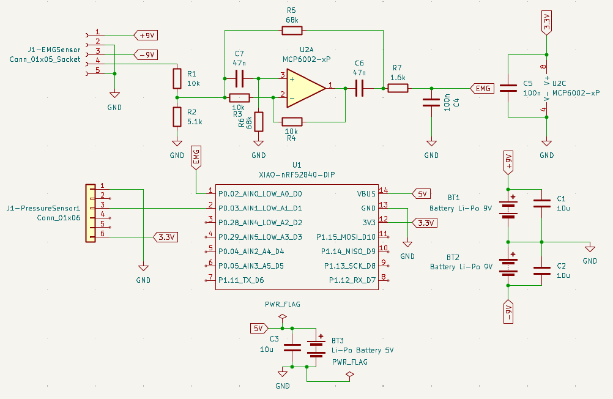
</p>

The first prototype used a **Muscle Sensor V3.0** EMG sensor with an analog filter cascade (band-stop at 50 Hz + low-pass at 1000 Hz). The original single-unit board integrated all sensors (pressure, EMG, IMU) on one wrist-worn device powered by two 9 V batteries. Two critical problems emerged:

**Battery problem:** The Muscle Sensor V3.0 requires a ±9 V bipolar supply. Generating this from two 9 V batteries (each 45 g) mounted on the wrist added significant mass — enough to mechanically affect tremor measurements and distort baseline muscle load:

```
Greater load → higher permanent muscle strain → signal offset relative to unloaded baseline
```

Because the NRF52 board accepts a maximum of 3.3 V on its pins, the bipolar supply was stepped down with a voltage divider (`R1 = 10 kΩ`, `R2 = 5.1 kΩ` → ≈ 3.04 V). A band-stop filter (MCP6002 op-amp, `C7 = 47 nF`, `R6 = 68 kΩ`) targeted 50 Hz mains (≈ 49.7 Hz), and a low-pass stage (`R7 = 1.6 kΩ`, `C = 100 nF`) cut noise above ≈ 995 Hz.

**Analog filtering problem:** Component availability in the lab was limited; the exact resistor-capacitor values for the target filter frequencies were not always obtainable. Compromise values resulted in poorly attenuated noise, requiring additional digital post-processing anyway. Since digital filtering on the NRF52840 is more precise and flexible than any analog cascade achievable with available parts, analog filtering was abandoned entirely.

#### Current Design Improvements

<p align="center">
  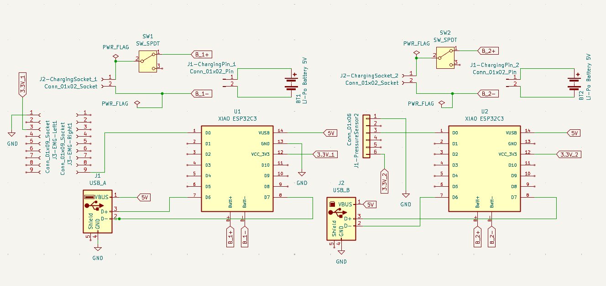
</p>

The new EMG-LAB sensor has both electrodes embedded directly on the board. To minimize wire length between the sensor and the microcontroller (reducing noise), the board and sensor are placed on the inner forearm. Since tremor must still be measured at the wrist, the original single device was split into two independent units: one on the wrist and one on the inner forearm.

| Aspect | Old Design | Current Design |
|---|---|---|
| EMG sensor | Muscle Sensor V3.0 | EMG-LAB (3.3V, on-board electrodes) |
| Power supply | 2× 9V batteries (90g) | 2× Li-Po 5V (10g each) |
| Analog filtering | Band-stop + low-pass RC circuits | Removed — fully digital |
| Physical form | Single unit on wrist | Two units: forearm (EMG) + wrist (IMU/Pressure) |
| Weight (forearm) | — | 21 g (27 g with battery) |
| Weight (wrist) | — | 16 g (35 g with battery) |
| IMU placement | Wrist | Wrist (enables future forearm tremor localization) |

The two boards each have their own 5 V Li-Po battery on a 2-pin JST connector, so every unit operates fully independently, both operationally and energetically. Dedicated slide switches allow each device to be turned on independently and shut down in a controlled manner.

PCBs were designed for both devices according to the tested prototypes and their circuits. Due to the limited budget and capabilities of the university equipment, PCB fabrication was abandoned in favor of perfboard prototypes trimmed to fit the components — but the completed board designs are documented here as the intended production form.

**PCB layouts (2D):**
<p align="center">
  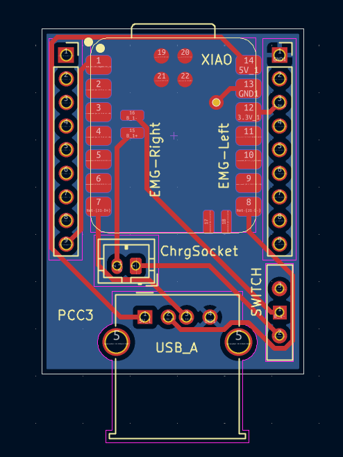
  &nbsp;
  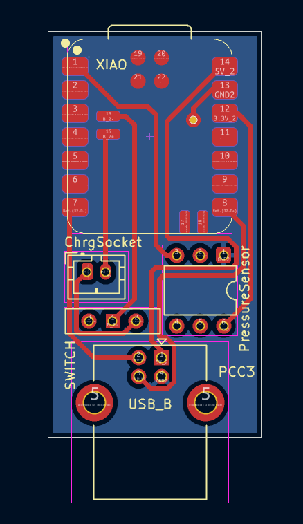
</p>
<p align="center"><i>(left) Forearm device — EMG sensor board &nbsp;•&nbsp; (right) Wrist device — pressure sensor board</i></p>

**PCB 3D renders:**
<p align="center">
  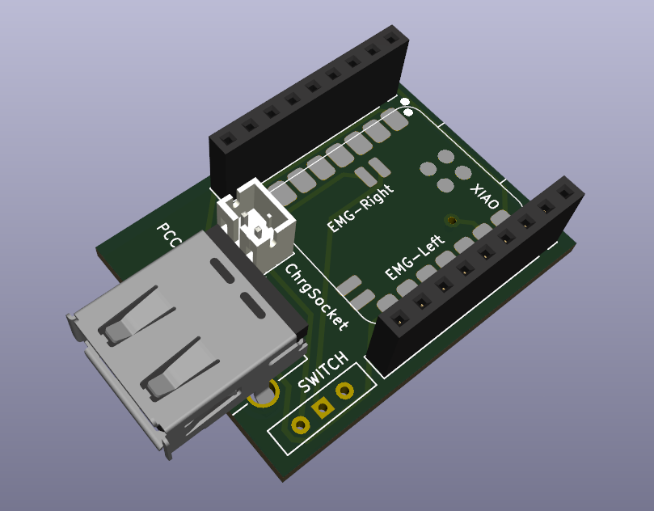
  &nbsp;
  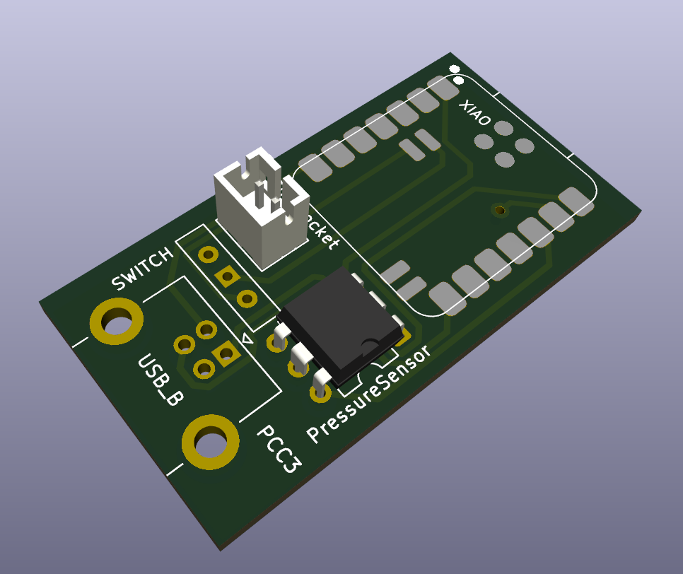
</p>
<p align="center"><i>(left) Forearm device 3D view &nbsp;•&nbsp; (right) Wrist device 3D view</i></p>

Image of the forearm device
<p align="center">
  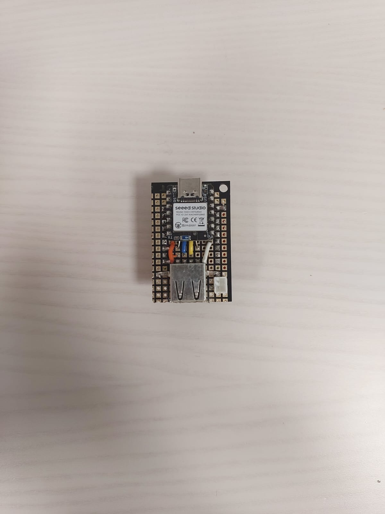
  &nbsp;
  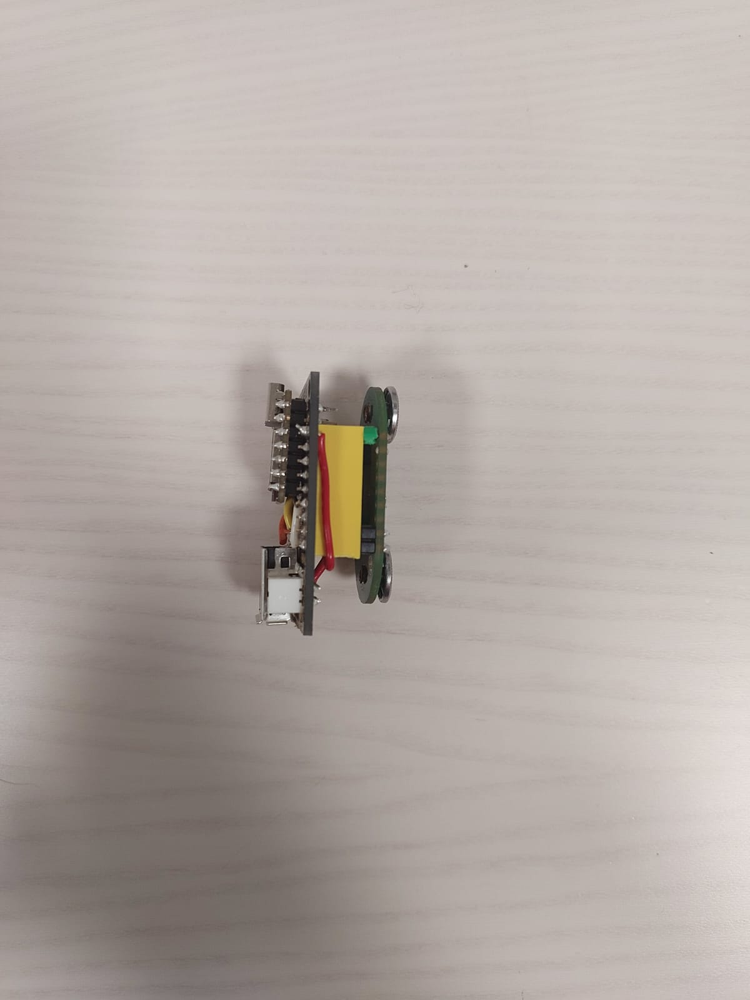
</p>

Image of the wrist device and the general view of the system
<p align="center">
  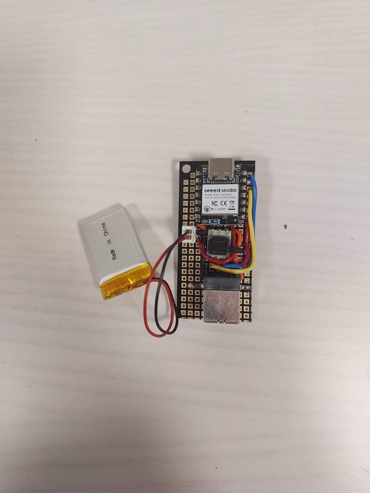
  &nbsp;
  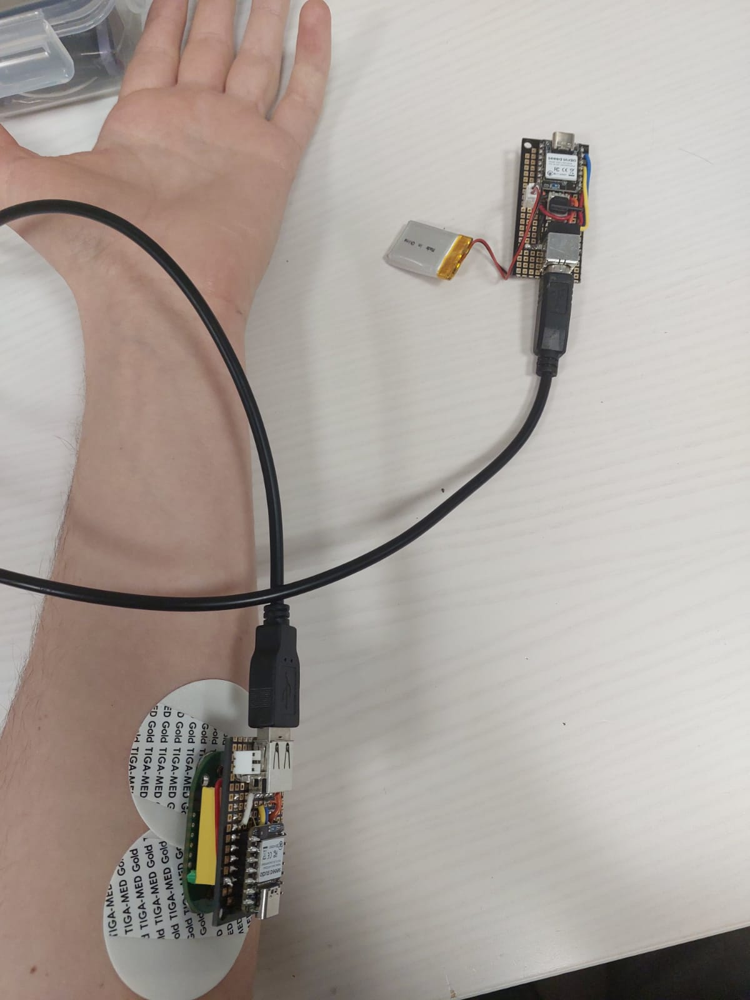
</p>

---

## Embedded Firmware

Both microcontrollers run identical **40 ms timing loops**, giving a system-wide sampling rate of **25 Hz**. This rate provides a ~56% margin above the Nyquist minimum for the 4–12 Hz tremor band, lets the frame fit within the negotiated BLE MTU, and allows the MCU to deep-sleep between transmissions (battery life > 8 h continuous).

**Micro 1 (forearm — EMG):** samples EMG at 25 Hz, runs the on-device two-stage preprocessing (DC offset removal + 50 Hz IIR notch + 20–450 Hz band-pass), and pushes each value over UART.

**Micro 2 (wrist — aggregation + BLE):** three concurrent tasks —
- **Pressure:** 12-bit ADC reading (0–4095) from `D0`, normalized to 8-bit (÷16)
- **IMU:** LSM6DS3 over I²C `0x6A`, `CTRL1_XL`/`CTRL2_G = 0x60`, decimated to 25 Hz
- **EMG reception:** character-by-character UART parser on the `E,<value>\n` stream

Every 40 ms the aggregated values are packed into a single comma-separated ASCII frame and sent via the Nordic UART Service (NUS):

```
F,<frame_id>,<pressure>,<emg>,<ax>,<ay>,<az>,<gx>,<gy>,<gz>\n
```

Frames are ~35–40 bytes. Integrity is checked by counting comma separators (9 expected); malformed frames are discarded. A **247-byte MTU** is requested at connection so the full frame fits in one BLE packet without fragmentation, though the system still works if a lower MTU is negotiated. Transmission is fire-and-forget (no retransmission); frame-ID gaps flag packet loss, which stays under 1% and does not affect clinical assessment.

---

## Case Design

A protective case is required for safe patient use: it must isolate the patient from the circuit elements and hold the board and battery cells together as one unit. Given the constraints of the available tools and 3D printer, each case is built around a **rigid printed substrate**, complemented by a soft outer layer:

- **Forearm (arm) device** — the rigid substrate is paired with a soft-plastic cover of a similar shape.
- **Wrist device** — the rigid substrate is fixed inside a sports band through purpose-designed eyelets.

**Case substrates (3D design):**
<p align="center">
  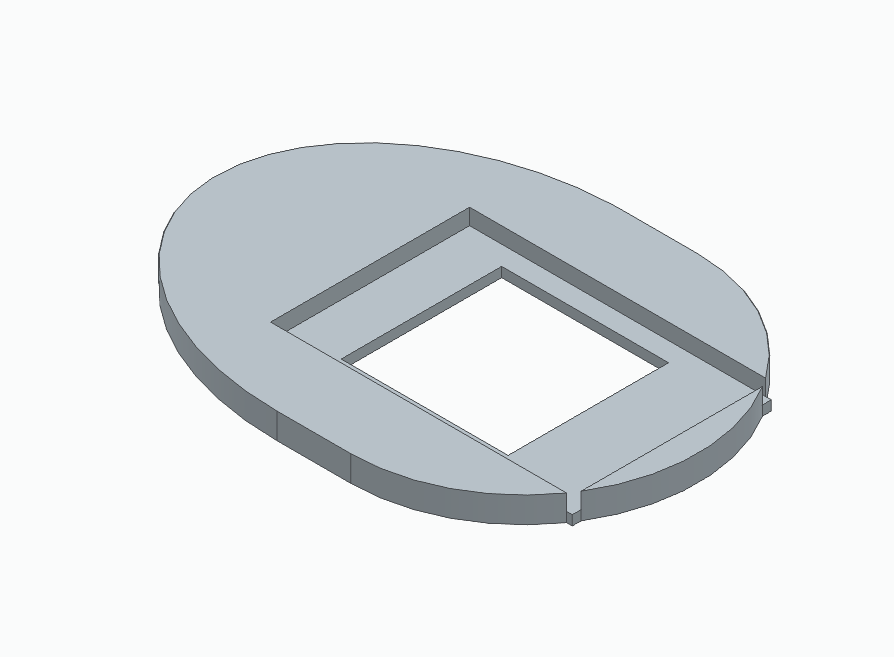
  &nbsp;
  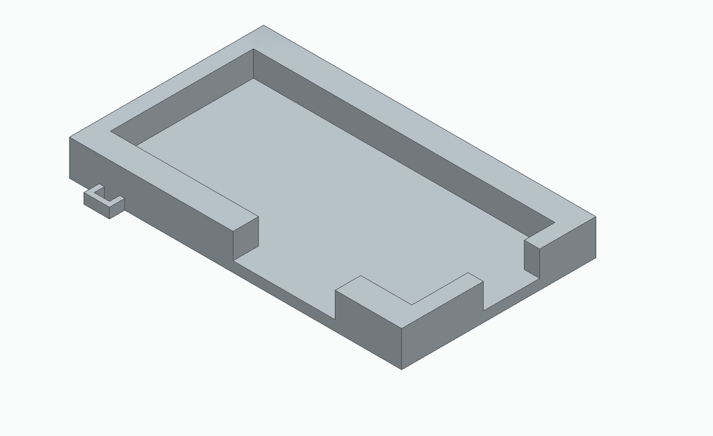
</p>
<p align="center"><i>(left) Arm device substrate &nbsp;•&nbsp; (right) Wrist device substrate</i></p>

**Assembled devices in their cases:**
<p align="center">
  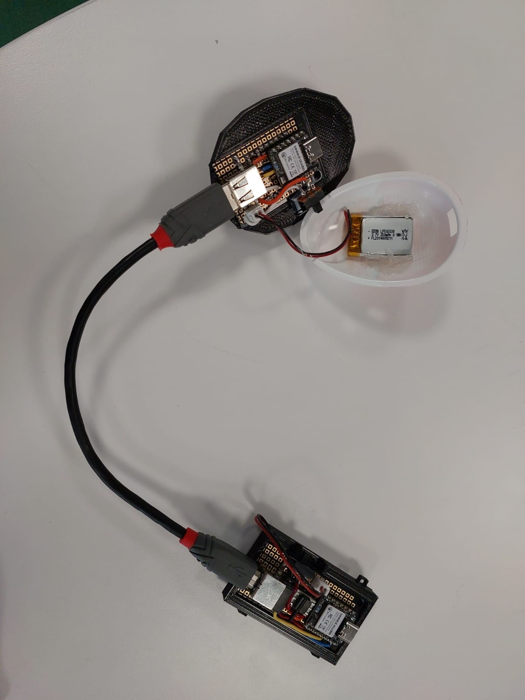
  &nbsp;
  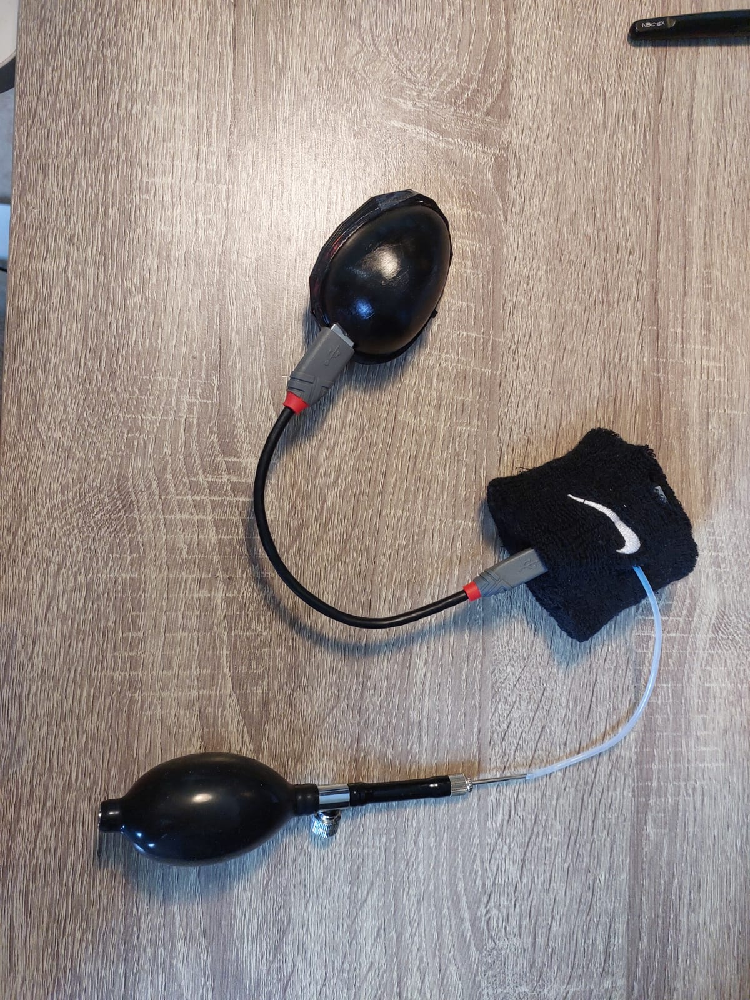
</p>
<p align="center"><i>(left) Assembled substrates &nbsp;•&nbsp; (right) Fully assembled devices with bulb and strap</i></p>

**Device in use:**
<p align="center">
  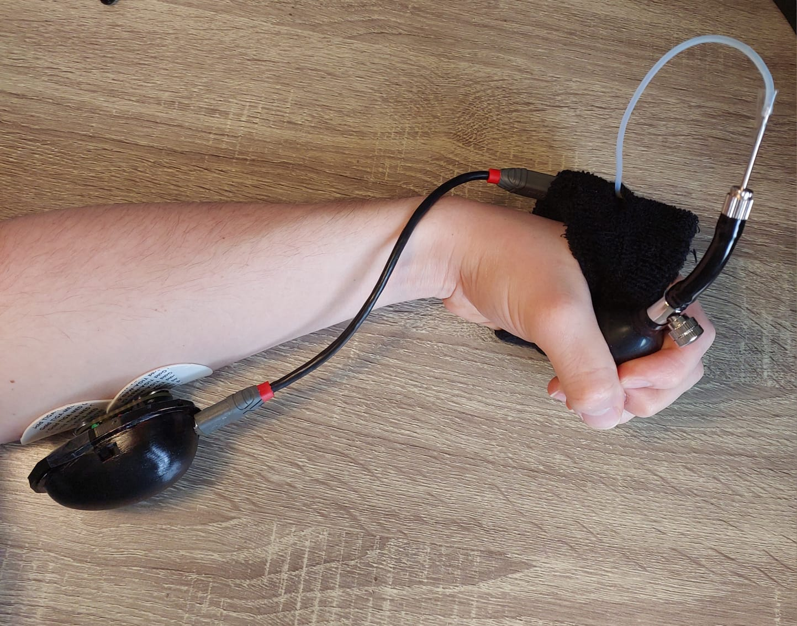
</p>
<p align="center"><i>General view of the system worn on the hand and forearm</i></p>

**Known limitations of the current case:**
- The university printer could not produce the complex mechanical elements originally planned to hold the arm-device cap, so those were dropped.
- The main fasteners are currently weakly adhesive elements, which do not provide a sufficiently stable fit. Stronger *permanent* fastening is not acceptable, because the device must remain accessible for programming and configuration — a removable but firmer mechanism is needed.
- The EMG-sensor clip mechanism is particularly weak; its fastenings have loosened through wear, and since the sensor is on loan it cannot be permanently re-fitted.

---

## Device Specifications

### Forearm Unit
- **Weight:** 21 g (27 g including battery)
- **Dimensions:** 3.0 × 4.6 × 2.2 cm
- **Mounting:** Silver chloride gel electrodes adhered directly to the inner forearm skin
- **Battery:** 300 mAh Li-Po, 3.7–5 V, rechargeable via JST connector

### Wrist Unit
- **Weight:** 16 g (35 g including battery)
- **Dimensions:** 2.7 × 5.8 × 1.4 cm
- **Mounting:** Sports fabric strap on the outer wrist
- **Battery:** 300 mAh Li-Po, 3.7–5 V, rechargeable via JST connector

> For reference, a single 9 V battery weighs 45 g — illustrating the significant weight reduction achieved by moving to compact Li-Po cells.

---

## Component List

| Component | Model / Type | Role |
|---|---|---|
| Main board ×2 | NRF52840 (NRF52 family) | Core controller, BLE, IMU |
| IMU | LSM6DS3 (on-board, 3-axis accel + gyro) | Motion and tremor sensing |
| Pressure sensor | ABP-DRRV060MGAA5 | Grip force measurement |
| EMG sensor | EMG-LAB (lab-sourced) | Muscle activation measurement |
| Forearm connector | USB-B (4-pin) | UART inter-device link |
| Wrist connector | USB-A (4-pin) | UART inter-device link |
| Batteries ×2 | 3.7–5 V Li-Po, 300 mAh | Board power supply |
| Electrode pads | Silver chloride gel | EMG signal acquisition |

---

## Future Hardware Work

**Enclosure & mechanical**
- **Stronger case fastening:** replace the weak adhesive fasteners with a firmer *removable* mechanism (e.g. clothespin-style clips) or use more advanced printing methods, while keeping the device accessible for programming and configuration.
- **EMG sensor clip:** the borrowed EMG-LAB mounting clip has loosened with wear and needs a proper replacement holder.
- **Manufactured PCBs:** fabricate the documented board designs instead of perfboard prototypes once budget/equipment allow.

**Power**
- **Power switch:** slide switches are present per unit; a unified power scheme is desirable.
- **Unified charging:** single charging port / switch for both units instead of two separate JST connectors.

**Sensing**
- **Extended sensor coverage:** additional IMU unit on the forearm to localize tremor by segment.
- **Analog filter revisit:** at a later stage, when minimizing acquisition latency becomes critical, a minimal analog pre-filter stage may be reintroduced.

---

## Authors

This project was developed as part of a university course project.

- **Iaroslav Petrishchev** — Hardware design, electrical schematics, component selection and procurement, device assembly and testing, case design *(this repository)*
- **Naya Nasr** [LinkedIn](https://www.linkedin.com/in/nasrnaya/)  — NRF52 sensor programming, data acquisition firmware, web application, machine learning pipeline
- **Lucía Pérez Sáez** [LinkedIn]( https://www.linkedin.com/in/lucia-perez-saez/)  — Exercise protocols, signal processing design, backend integration, FSM and WebSocket logic

---

## License

To be determined.
